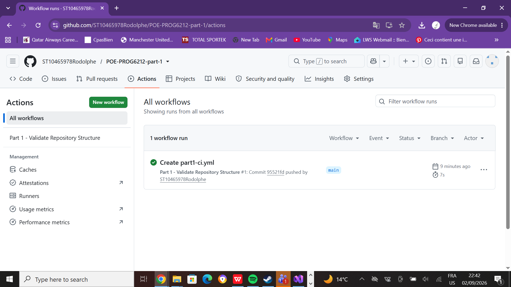

# POE-PROG6212-part-1

RaceDay — Part 1: System Planning and Database
Description

RaceDay is a full-stack event management system built for the South African road running, walking, and cycling community. It allows Event Organisers to create and manage events, categories, and participant results, while Participants can browse upcoming events, enter events, track their personal performance history, and prepare for race day using route information.

This repository covers Part 1 of the project: system planning. It contains the Entity Relationship Diagram, the API endpoint plan, and the SQL database script for the RaceDay system. No application code is written in this part.

Roles

The system supports two distinct user roles:

Organiser — can create, edit, and delete events, manage event categories, capture participant results, and view all event enrolments.
Participant — can create an account, browse events, enter an event by selecting a category, view their own enrolments, and track their personal results.

- **Admin oversight**: Organisers can only manage events they created; role checks are enforced at the API level in Part 2.

## Design Decisions

- Distance is stored on Category rather than Event, since a single event (e.g. a running day) can offer multiple distances (5km, 10km, 21km) as separate categories.
- Enrolment links directly to Category (not Event) to avoid data redundancy, since the event can always be derived via Category → Event.

Technologies Used
SQL Server Management Studio (SSMS) with (localdb)\MSSQLLocalDB
Draw.io for ERD design
GitHub Actions for CI/CD
Markdown / PDF for documentation
Repository Structure
/docs
  ├── RaceDay_ERD.drawio.pdf          # Entity Relationship Diagram
  ├── RaceDay API Endpoint Plan.pdf   # Full API endpoint plan
  ├── RaceDay_Database.sql            # SQL script (schema + seed data)
  └── ci-success.PNG                  # CI/CD success screenshot
/.github/workflows
  └── part1-ci.yml                    # GitHub Actions workflow (validates /docs structure)
README.md
Setup Instructions
Clone this repository:
bash
   git clone <YOUR_REPO_URL>
Open docs/RaceDay_Database.sql in SQL Server Management Studio (SSMS).
Run the entire script (F5) against a local SQL Server / LocalDB instance. The script drops and recreates RaceDayDB from scratch, so it runs cleanly on any instance.
Review the ERD in docs/RaceDay_ERD.drawio.pdf and the endpoint plan in docs/RaceDay API Endpoint Plan.pdf.
CI/CD

GitHub Actions validates that the /docs folder exists and contains the required files on every push.

Screenshot of a successful green build:

Video Presentation

An unlisted YouTube video walking through the planning documents, the ERD decisions, the endpoint plan choices, and a live run of the SQL script in SSMS:

[Insert your YouTube link here]

(This project is developed as part of the PROG6212 Portfolio of Evidence).
